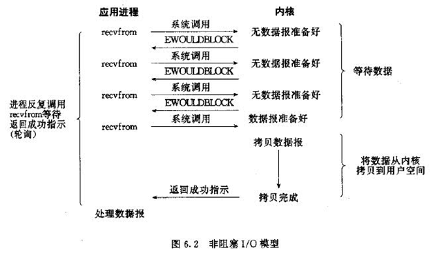
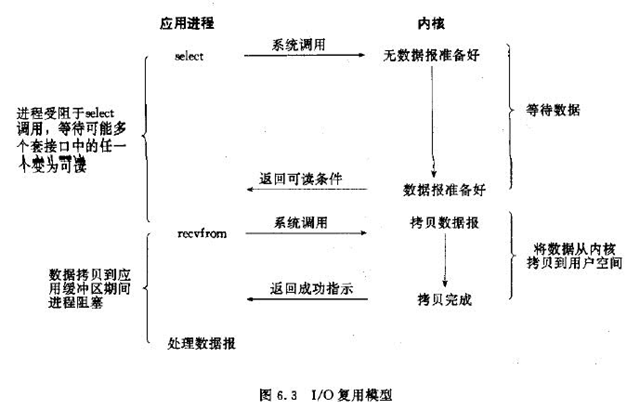
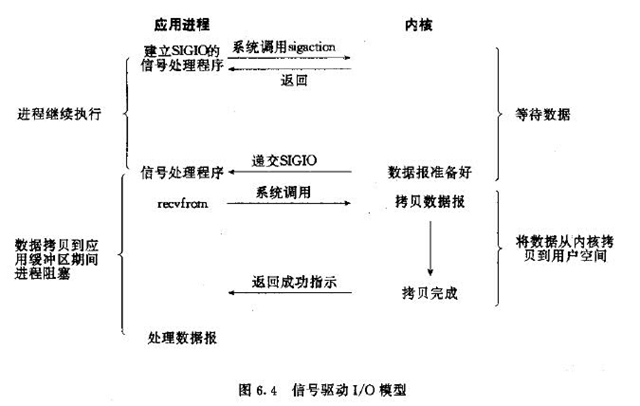
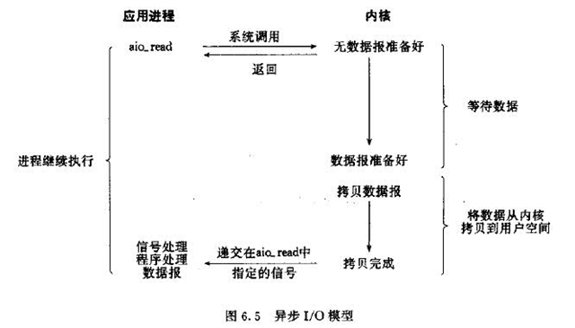
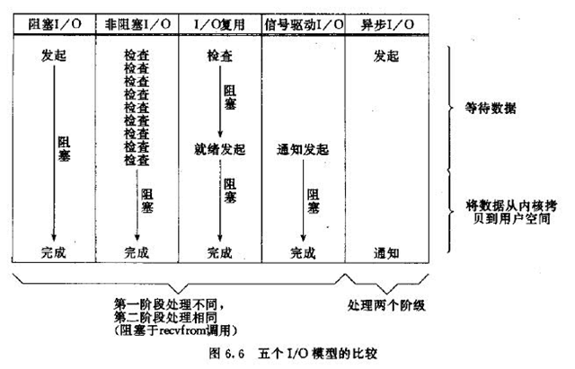

##Unix 五种网络模型

Linux recvfrom函数用于从socket中接收数据，
分为两个阶段：
1, 等待数据；
2, 将数据从内核空间拷贝到用户空间。

>为什么将数据从内核空间拷贝到用户空间？？  

    CPU将指令分为特权指令和非特权指令。
    Intel CPU将特权等级分为4个级别：Ring0~Ring3。
    Linux系统只使用了Ring0和Ring3，
    当进程运行在Ring3级别时被称为运行在用户态，
    而运行在 Ring0 级别时被称为运行在内核态。
    因此，Linux区分内核空间和用户空间本质上是要提高操作系统的稳定性及可用性.
    所有的系统资源管理都是在内核空间中完成的。
    比如读写磁盘文件，分配回收内存，从网络接口读写数据等等。
    我们的应用程序是无法直接进行这样的操作的，但是我们可以通过内核提供的接口来完成这样的任务。 
    linux在从用户态系统调用进入内核态时，需要将数据从用户空间拷贝到内核空间；
    同理，在从内核态进入用户态时，需要把数据从内核空间拷贝到用户空间。

注：图片来源于网络

### blocking io

### non-blocking io

### multiplex io 
select/poll/epoll是几种常见的IO多路复用。
I/O多路复用是阻塞在select/epoll这样的系统调用之上，
而没有阻塞在真正的I/O系统调用如recvfrom之上。 

### signal io

### async io

### summary

Jdk 1.4之前的BIO实现的是blocking io.
Jdk 1.4之后的NIO (New IO)实现的multiplex io.
Jdk 1.7中引用了async io. 

> NIO是同步非阻塞的，具体含义是什么？？
    
    阻塞 vs 非阻塞：进程/线程要访问的数据是否就绪，进程/线程是否需要等待；
    
    同步 vs 异步：访问数据的方式;
    1. 同步需要主动读写数据，在读写数据的过程中还是会阻塞；
    2. 异步只需要I/O操作完成的通知，并不主动读写数据，由操作系统内核完成数据的读写。

>netty没有实现async-io，主要是因为在Linux上，epoll 比async-io更快。
https://github.com/netty/netty/issues/2515

