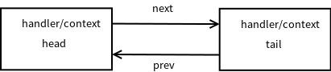

## NioSocketChannel

### NioSocketChannel调用无参构造函数实例化
ref: https://segmentfault.com/a/1190000007282789

NioSocketChannel -> AbstractNioByteChannel -> AbstractNioChannel -> AbstractChannel.
总结一下构造一个 NioSocketChannel 所需要做的工作:

- 调用 NioSocketChannel.newSocket(DEFAULT_SELECTOR_PROVIDER) 打开一个新的 Java NIO SocketChannel, 对于Linux平台是SocketChannelImpl．

- AbstractChannel(Channel parent) 中初始化 AbstractChannel 的属性:
    - parent 属性置为 null
    - unsafe 通过newUnsafe() 实例化一个 unsafe 对象, 它的类型是　NioSocketChannel.NioSocketChannelUnsafe 内部类
    - pipeline 是 new DefaultChannelPipeline(this) 新创建的实例. 这里体现了:
        >Each channel has its own pipeline and it is created automatically when a new channel is created.

- AbstractNioChannel 中的属性:
    - SelectableChannel ch 被设置为 Java SocketChannel, 即 NioSocketChannel#newSocket 返回的 Java NIO SocketChannel.
    - readInterestOp 被设置为 SelectionKey.OP_READ
    - SelectableChannel ch 被配置为非阻塞的 ch.configureBlocking(false)

- NioSocketChannel 中的属性:
    - SocketChannelConfig config = new NioSocketChannelConfig(this, socket.socket())


NioSocketChannel的无参构造函数使用缺省的SelectorProvider，　在Linux平台实际上是EPollSelectorProvider.
在newSocket方法中调用EPollSelectorProvider#openSocketChannel方法，返回一个SocketChannelImpl实例．
```java
public class NioSocketChannel extends AbstractNioByteChannel implements io.netty.channel.socket.SocketChannel {
    private static final SelectorProvider DEFAULT_SELECTOR_PROVIDER = SelectorProvider.provider();
    private static SocketChannel newSocket(SelectorProvider provider) {
        try {
            return provider.openSocketChannel();
        } catch (IOException e) {
            throw new ChannelException("Failed to open a socket.", e);
        }
    }

    private final SocketChannelConfig config;

    /**
     * Create a new instance
     */
    public NioSocketChannel() {
        this(DEFAULT_SELECTOR_PROVIDER);
    }
    
    public NioSocketChannel(SelectorProvider provider) {
        this(newSocket(provider));
    }
    
    public NioSocketChannel(SocketChannel socket) {
        this(null, socket);
    }
    
    public NioSocketChannel(Channel parent, SocketChannel socket) {
        super(parent, socket);
        config = new NioSocketChannelConfig(this, socket.socket());
    }
    
    @Override
    protected AbstractNioUnsafe newUnsafe() {
        return new NioSocketChannelUnsafe();
    }
}
```

```java
public abstract class AbstractNioByteChannel extends AbstractNioChannel {
    protected AbstractNioByteChannel(Channel parent, SelectableChannel ch) {
        super(parent, ch, SelectionKey.OP_READ);
    }
}
```

AbstractNioChannel把SocketChannelImpl保存下来，　readInterestOp为SelectionKey.OP_READ.
调用SocketChannelImpl#configureBlocking方法，设置为非阻塞．
```java
public abstract class AbstractNioChannel extends AbstractChannel {
    private final SelectableChannel ch;
    protected final int readInterestOp;

    protected AbstractNioChannel(Channel parent, SelectableChannel ch, int readInterestOp) {
        super(parent);
        this.ch = ch;
        this.readInterestOp = readInterestOp;
        try {
            ch.configureBlocking(false);
        } catch (IOException e) {
            try {
                ch.close();
            } catch (IOException e2) {
                if (logger.isWarnEnabled()) {
                    logger.warn(
                            "Failed to close a partially initialized socket.", e2);
                }
            }

            throw new ChannelException("Failed to enter non-blocking mode.", e);
        }
    }
}
```

AbstractChannel构造函数中对unsafe, pipline进行赋值．
这是newUnsafe()方法在NioSocketChannel中被覆写了，返回一个NioSocketChannelUnsafe实例.
newChannelPipeline()方法返回一个DefaultChannelPipeline实例．
此时, DefaultChannelPipeline内部结构为，

这里，显然可以得出一个结论，**一个SelectableChannel对应一个pipline**.
```java
public abstract class AbstractChannel extends DefaultAttributeMap implements Channel {
    private final Channel parent;
    private final ChannelId id;
    private final Unsafe unsafe;
    private final DefaultChannelPipeline pipeline;
  
    protected AbstractChannel(Channel parent) {
        this.parent = parent;
        id = newId();
        unsafe = newUnsafe();
        pipeline = newChannelPipeline();
    }
    
    protected DefaultChannelPipeline newChannelPipeline() {
        return new DefaultChannelPipeline(this);
    }
 }
```

