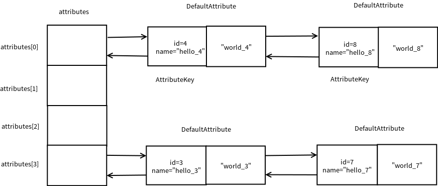

DefaultAttributeMap　是一个线程安全的　AttributeMap　接口实现．
内部属性　attributes　是一个原子引用数组，元素类型为　DefaultAttribute．

    AtomicReferenceArray<DefaultAttribute<?>> attributes;
    
DefaultAttribute　继承了　AtomicReference，因此可以线程安全地去设置值．
同时，DefaultAttribute包含prev, next属性，是一个典型的双链表结点．
相同的 key.id() & MASK 会组成一个双链表．

```java
private static final class DefaultAttribute<T> extends AtomicReference<T> implements Attribute<T> {
    // The head of the linked-list this attribute belongs to
    private final DefaultAttribute<?> head;//头引用
    private final AttributeKey<T> key;//键

    // Double-linked list to prev and next node to allow fast removal
    private DefaultAttribute<?> prev;
    private DefaultAttribute<?> next;

    // Will be set to true one the attribute is removed via getAndRemove() or remove()
    private volatile boolean removed;
}
```

下面看一个基本的测试程序
```java
public class DefaultAttributeMapTest {
    @Test
    public void test02() {
        DefaultAttributeMap attributeMap = new DefaultAttributeMap();

        for (int i = 1; i < 10; i++) {
            AttributeKey<String> key1 = AttributeKey.valueOf(String.format("hello_%d", i));//新建一个AttributeKey
            Assert.assertFalse(attributeMap.hasAttr(key1));

            Attribute<String> attr1 = attributeMap.attr(key1);
            Assert.assertEquals(attr1.key(), key1);
            attr1.set(String.format("word_%d", i));//设置值
            Assert.assertEquals(attr1.get(), String.format("word_%d", i));
        }
    }
}
```

### DefaultAttributeMap内部结构
