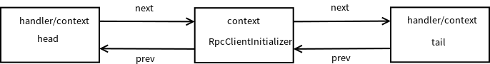

## Client端代码

    Bootstrap b = new Bootstrap();
    b.group(eventLoopGroup)
            .channel(NioSocketChannel.class)
            .handler(new RpcClientInitializer());

    ChannelFuture channelFuture = b.connect(remotePeer);
    channelFuture.addListener(new ChannelFutureListener() {
        @Override
        public void operationComplete(final ChannelFuture channelFuture) throws Exception {
            if (channelFuture.isSuccess()) {
                logger.debug("Successfully connect to remote server. remote peer = " + remotePeer);
                RpcClientHandler handler = channelFuture.channel().pipeline().get(RpcClientHandler.class);
                addHandler(handler);
            }
        }
    });
    
```java
public class RpcClientInitializer extends ChannelInitializer<SocketChannel> {
    @Override
    protected void initChannel(SocketChannel socketChannel) throws Exception {
        ChannelPipeline cp = socketChannel.pipeline();
        cp.addLast(new RpcEncoder(RpcRequest.class));
        cp.addLast(new LengthFieldBasedFrameDecoder(65536, 0, 4, 0, 0));
        cp.addLast(new RpcDecoder(RpcResponse.class));
        cp.addLast(new RpcClientHandler());
    }
}
```

首先Bootstrap继承于AbstractBootstrap
```java
public class Bootstrap extends AbstractBootstrap<Bootstrap, Channel> {
    public Bootstrap() { }
}
```

Bootstrap　没有覆写group方法，而AbstractBootstrap#group方法是一个简单赋值．
同样，Bootstrap 也没有覆写handler方法, AbstractBootstrap#handler方法也是一个简单赋值(RpcClientInitializer -> ChannelInitializer -> ... -> ChannelHandler)．
```java
public abstract class AbstractBootstrap<B extends AbstractBootstrap<B, C>, C extends Channel> implements Cloneable {
    volatile EventLoopGroup group;
    private volatile ChannelHandler handler;

    AbstractBootstrap() {
        // Disallow extending from a different package.
    }

    public B group(EventLoopGroup group) {
        if (group == null) {
            throw new NullPointerException("group");
        }
        if (this.group != null) {
            throw new IllegalStateException("group set already");
        }
        this.group = group;
        return self();
    }
    
    private B self() {
        return (B) this;
    }
    
    public B channel(Class<? extends C> channelClass) {
        if (channelClass == null) {
            throw new NullPointerException("channelClass");
        }
        return channelFactory(new ReflectiveChannelFactory<C>(channelClass));
    }
    
    public B handler(ChannelHandler handler) {
        if (handler == null) {
            throw new NullPointerException("handler");
        }
        this.handler = handler;
        return self();
    }
}
```


Bootstrap　没有覆写channel方法，而AbstractBootstrap#channel方法调用channelFactory方法给属性赋值．

```java
public abstract class AbstractBootstrap<B extends AbstractBootstrap<B, C>, C extends Channel> implements Cloneable {
    
    public B channel(Class<? extends C> channelClass) {
        if (channelClass == null) {
            throw new NullPointerException("channelClass");
        }
        return channelFactory(new ReflectiveChannelFactory<C>(channelClass));
    }
    
    public B channelFactory(io.netty.channel.ChannelFactory<? extends C> channelFactory) {
        return channelFactory((ChannelFactory<C>) channelFactory);
    }
    
    public B channelFactory(ChannelFactory<? extends C> channelFactory) {
        if (channelFactory == null) {
            throw new NullPointerException("channelFactory");
        }
        if (this.channelFactory != null) {
            throw new IllegalStateException("channelFactory set already");
        }

        this.channelFactory = channelFactory;
        return self();
    }
}
```

这里ReflectiveChannelFactory<C>构造函数中把　NioSocketChannel.class赋值给了clazz属性，　newChannel方法其实是通过反射实例化一个NioSocketChannel.
何时调用newChannel方法，见Bootstrap#connect方法说明**
```java
public class ReflectiveChannelFactory<T extends Channel> implements ChannelFactory<T> {

    private final Class<? extends T> clazz;

    public ReflectiveChannelFactory(Class<? extends T> clazz) {
        if (clazz == null) {
            throw new NullPointerException("clazz");
        }
        this.clazz = clazz;
    }

    @Override
    public T newChannel() {
        try {
            return clazz.getConstructor().newInstance();
        } catch (Throwable t) {
            throw new ChannelException("Unable to create Channel from class " + clazz, t);
        }
    }

    @Override
    public String toString() {
        return StringUtil.simpleClassName(clazz) + ".class";
    }
}
```


Bootstrap#connect方法，只是简单地调用内部方法doResolveAndConnect．
doResolveAndConnect方法首先调用initAndRegister方法．
    - 在initAndRegister中首先调用channelFactory.newChannel()实例化NioSocketChannel，　这时参考[7_Netty_NioSocketChannel.md](7_Netty_NioSocketChannel.md).　
    - 调用init方法
    - 调用config().group().register(channel)把channel注册到NioEventLoopGroup中去．


```java
public class Bootstrap extends AbstractBootstrap<Bootstrap, Channel> {

    public ChannelFuture connect(SocketAddress remoteAddress) {
        if (remoteAddress == null) {
            throw new NullPointerException("remoteAddress");
        }

        validate();
        return doResolveAndConnect(remoteAddress, config.localAddress());
    }
    
    private ChannelFuture doResolveAndConnect(final SocketAddress remoteAddress, final SocketAddress localAddress) {
        final ChannelFuture regFuture = initAndRegister();
        final Channel channel = regFuture.channel();

        if (regFuture.isDone()) {
            if (!regFuture.isSuccess()) {
                return regFuture;
            }
            return doResolveAndConnect0(channel, remoteAddress, localAddress, channel.newPromise());
        } else {
            // Registration future is almost always fulfilled already, but just in case it's not.
            final PendingRegistrationPromise promise = new PendingRegistrationPromise(channel);
            regFuture.addListener(new ChannelFutureListener() {
                @Override
                public void operationComplete(ChannelFuture future) throws Exception {
                    // Directly obtain the cause and do a null check so we only need one volatile read in case of a
                    // failure.
                    Throwable cause = future.cause();
                    if (cause != null) {
                        // Registration on the EventLoop failed so fail the ChannelPromise directly to not cause an
                        // IllegalStateException once we try to access the EventLoop of the Channel.
                        promise.setFailure(cause);
                    } else {
                        // Registration was successful, so set the correct executor to use.
                        // See https://github.com/netty/netty/issues/2586
                        promise.registered();
                        doResolveAndConnect0(channel, remoteAddress, localAddress, promise);
                    }
                }
            });
            return promise;
        }
    }
    
    final ChannelFuture initAndRegister() {
        Channel channel = null;
        try {
            channel = channelFactory.newChannel();//实例化channel, 参考7_Netty_NioSocketChannel.md
            init(channel);
        } catch (Throwable t) {
            if (channel != null) {
                // channel can be null if newChannel crashed (eg SocketException("too many open files"))
                channel.unsafe().closeForcibly();
                // as the Channel is not registered yet we need to force the usage of the GlobalEventExecutor
                return new DefaultChannelPromise(channel, GlobalEventExecutor.INSTANCE).setFailure(t);
            }
            // as the Channel is not registered yet we need to force the usage of the GlobalEventExecutor
            return new DefaultChannelPromise(new FailedChannel(), GlobalEventExecutor.INSTANCE).setFailure(t);
        }

        ChannelFuture regFuture = config().group().register(channel);
        if (regFuture.cause() != null) {
            if (channel.isRegistered()) {
                channel.close();
            } else {
                channel.unsafe().closeForcibly();
            }
        }

        // If we are here and the promise is not failed, it's one of the following cases:
        // 1) If we attempted registration from the event loop, the registration has been completed at this point.
        //    i.e. It's safe to attempt bind() or connect() now because the channel has been registered.
        // 2) If we attempted registration from the other thread, the registration request has been successfully
        //    added to the event loop's task queue for later execution.
        //    i.e. It's safe to attempt bind() or connect() now:
        //         because bind() or connect() will be executed *after* the scheduled registration task is executed
        //         because register(), bind(), and connect() are all bound to the same thread.

        return regFuture;
    }
    
    abstract void init(Channel channel) throws Exception;
 }
```

Bootstrap#init把handler加入到NioSocketChannel的pipline中，　这里的handler实际上是RpcClientInitializer.
此时，pipline结构如下：
```java
public class Bootstrap extends AbstractBootstrap<Bootstrap, Channel> {
    @Override
    @SuppressWarnings("unchecked")
    void init(Channel channel) throws Exception {
        ChannelPipeline p = channel.pipeline();
        p.addLast(config.handler());

        final Map<ChannelOption<?>, Object> options = options0();
        synchronized (options) {
            setChannelOptions(channel, options, logger);
        }

        final Map<AttributeKey<?>, Object> attrs = attrs0();
        synchronized (attrs) {
            for (Entry<AttributeKey<?>, Object> e: attrs.entrySet()) {
                channel.attr((AttributeKey<Object>) e.getKey()).set(e.getValue());
            }
        }
    }
}
```

